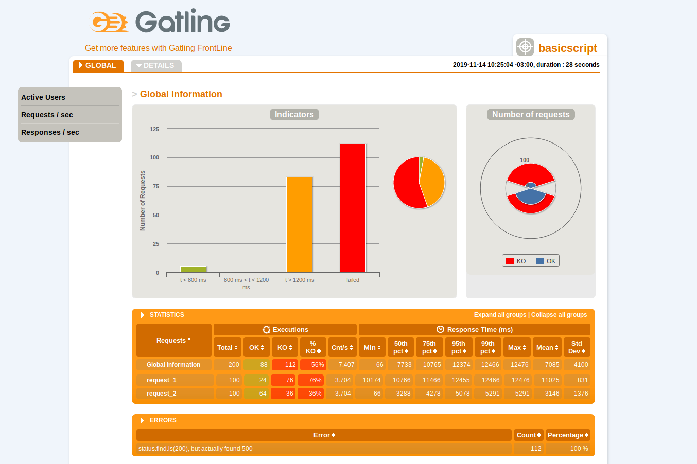

## no-escalapp

Mini REST API que lo único que hace es demorarse en responder y oucpar recursos del contenedor en donde vive.

### No escala?

Cada nuevo request generará una nueva carga en el CPU por un random de segundos. Al llegar a 100% de CPU, la aplicación empezará a responder con un error HTTP 500 de Internal Server Error.

### Y como la rompemos?

Primero, levantamos el contenedor con el flag compatibility

    docker-compose --compatibility up

Después, ejecutamos el script de Gatling que ya está configurado en el pom.xml de la siguiente manera

    ./mvnw gatling:test

Al terminar ese comando, nos indica el archivo donde se generó un reporte HTML con la información detallada de toda la corrida

Cuando accedan al archivo, deben ver algo como esto

    
